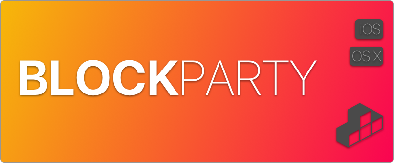
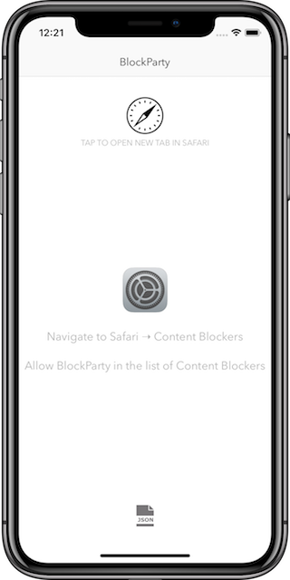
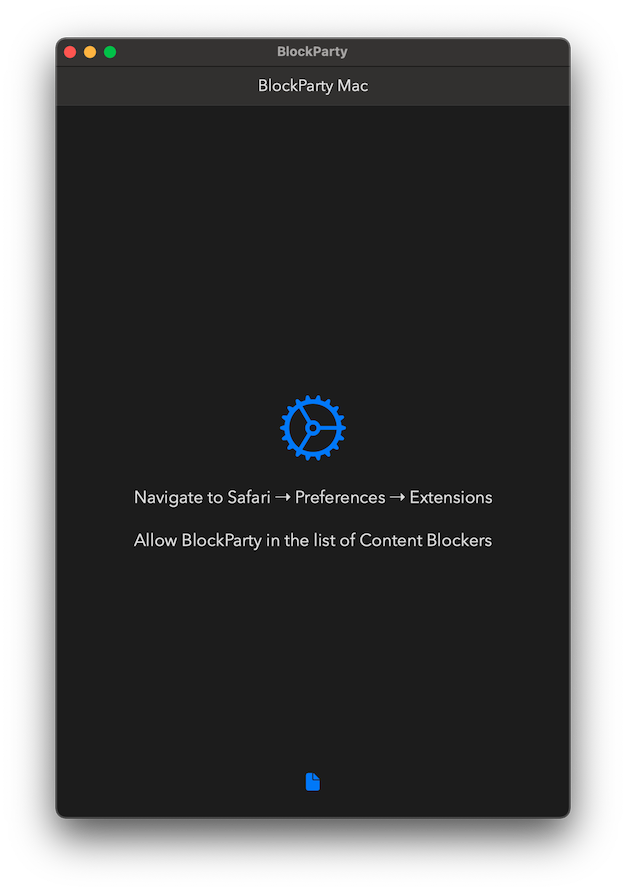
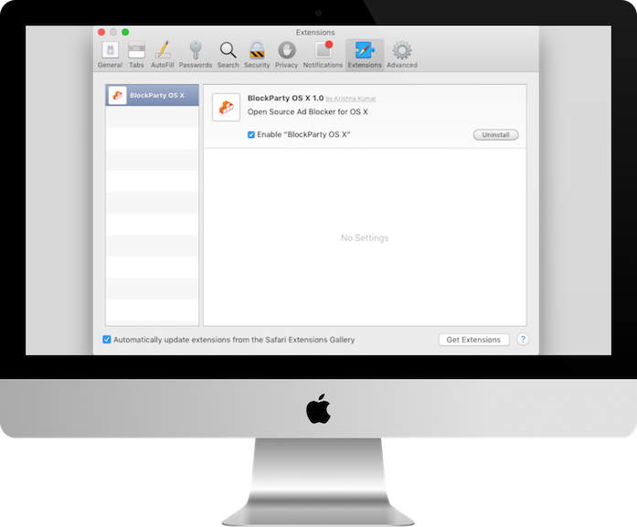

[](https://dashboard.buddybuild.com/apps/562a8a646f3b010100cc3648/build/latest)
[](LICENSE)

- Blocks content from annoying ad networks thereby loading pages super fast

- Useful for data-capped, international roaming data connections

- Blocking rules are at [RediffBlock/blockerList.json](RediffBlock/blockerList.json)

- View JSON in app

- Universal app contains link to Settings, JSON and instructions for turning on Content Blockers

## Screenshots





## How to Install - iOS

You need Xcode 7 or later. And an iOS device running atleast iOS 9.

Step 1

Open a new terminal window in OS X. Refer to [this guide](http://blog.teamtreehouse.com/introduction-to-the-mac-os-x-command-line) on using the OS X Terminal.

```bash
git clone https://github.com/krishkumar/BlockParty.git
```

Step 2

```bash
  cd BlockParty
```

Step 3

Open `BlockParty.xcodeproj` in Xcode.


Step 4

Build and run the application.

- When running this application on a device you will need to add a signing profile in the project's Build Settings.


Step 5

Allow `BlockParty` in Content Blockers under Settings → Safari.

## How to Install - OS X

BlockParty is not available in the Safari gallery. Instead, you must build from source. Follow the below instructions to install from source.

* Instructions to install desktop version: [How to Use BlockParty for Desktop Safari](https://github.com/krishkumar/BlockParty/blob/master/BlockParty%20-%20Desktop%20Safari/How%20to%20Install.md)

I am in the process of making a pre-built package signed by me. Installing this is as easy as double clicking or drag to Safari.

## Tested

- iPad mini 2 running iOS 9
- iPhone 6 running iOS 9
- Desktop version tested on Safari 9 for Yosemite & El Capitan

## Device Compatibility

- iPhone: iPhone 5 and above
- iPad: iPad (4th generation) or iPad mini (2nd generation) and above
- iPod touch: iPod touch (6th generation)


## References

* A step-by-step guide: [installing BlockParty on a device with iOS 9 beta installed](https://medium.com/@searls/installing-a-content-blocker-on-ios-9-public-beta-a25b2b83848f)
* Instructions to install desktop version: [How to Use BlockParty for Desktop Safari](https://github.com/krishkumar/BlockParty/blob/master/BlockParty%20-%20Desktop%20Safari/How%20to%20Install.md)
* WWDC 2015 Session 511: [Safari Extensibility: Content Blocking and Shared Links](https://developer.apple.com/videos/wwdc/2015/?id=511)
* Introduction to WebKit Content Blockers: [Introduction & JSON Syntax](https://www.webkit.org/blog/3476/content-blockers-first-look/)
